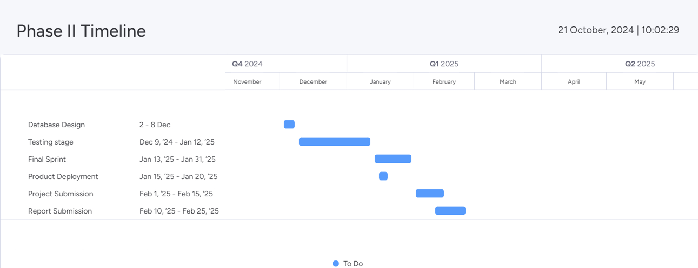

# UNIVERSAL CONTEXTUAL
# SEMANTIC SEARCH
# (UCSS)

Guide:

M.s Ashitha Jose
Asst. Professor
Dept. of Electronics & Computer Engineering

Team Members:

Goutham Sreeram S B (21ECE029)
Jovit Mathew (21ECE039)
Haleem Muhsin (21ECE030)
Nikhil V (21ECE051)

Batch: ES

---

# CONTENTS:

* Problem Statement
* Interim Results
* Project Phase II Timeline
* Detailed Action Plan And Task Allocation
* Registration for Conference/ Journal etc (If any)
* References

---

# Local Search Implementation

---

# Cloud Search Implementation
 

---

# Project Timeline

---

# References (1/2)

1. J. Wan, D. Wang, S. C. H. Hoi, P. Wu, J. Zhu, Y. Zhang, and J. Li, "Deep learning for content-based image retrieval: A comprehensive study," in *Proc. 22nd ACM Int. Conf. Multimedia*, Orlando, FL, USA, Nov. 2014, pp. 157-166, doi: 10.1145/2647868.2654948.

2. A. Ahmed, "Pre-trained CNNs Models for Content-based Image Retrieval," *International Journal of Advanced Computer Science and Applications*, vol. 12, no. 7, pp. 200-206, Aug. 2021, doi: 10.14569/IJACSA.2021.0120723.

3. M. Wang, J. Liu, J. Wang, Y. Wang, and X. Chu, "A Topicality Relevance-Aware Intent Model for Web Search," *IEEE Access*, vol. 11, pp. 1-10, 2023, doi: 10.1109/ACCESS.2023.3289820.

---

# References (2/2)

4. J. N. V. R. S. Kumar, P. Pagolu, P. Yakkala, S. M. C. Potharlanka, S. Pasupuleti, and M. Pittu, "Efficient Data Searching and Management with Search Desk: A Customizable Search Engine for Accurate and Timely Results," in *14th ICCCNT IEEE Conference*, IIT-Delhi, India, July 2023, doi: 10.1109/ICCCNT56998.2023.10307516

5. M. S. Sayed, A. A. A. Gad-Elrab, K. A. Fathy, and K. R. Raslan, "A deep learning content-based image retrieval approach using cloud computing," *Indonesian Journal of Electrical Engineering and Computer Science*, vol. 29, no. 3, pp. 1577–1589, Mar. 2023, doi: 10.11591/ijeecs.v29.i3.pp1577-1589

